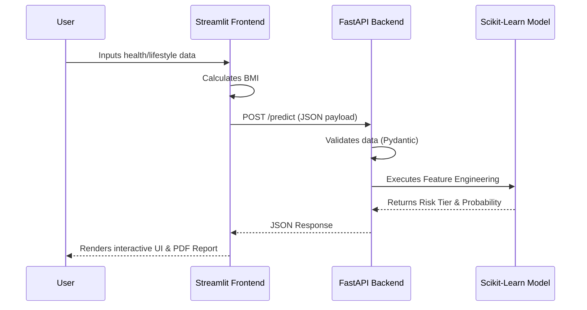

<div align="center">
  
  <h1>AegisIQ<span style="font-size: 1.1em;"><big>💠</big></span></h1>
  <p><b>Intelligent Risk Assessment & Machine Learning Underwriting Platform</b></p>
  
  [](https://python.org)
  [](https://fastapi.tiangolo.com/)
  [](https://streamlit.io/)
  [](https://scikit-learn.org/)
</div>

<br>

AegisIQ is a full-stack Machine Learning application designed to assess life insurance premium risk tiers based on dynamic demographic and lifestyle factors. It features a decoupled microservice architecture with a standalone **FastAPI backend** and a beautiful, interactive **Streamlit dashboard**.

---

## ✨ Key Features

- **End-to-End ML Pipeline**: Custom data processing, feature engineering (BMI & Lifestyle logic), and a highly optimized Random Forest Classifier.
- **FastAPI Microservice**: A lightning-fast REST API backend that handles data validation (via Pydantic) and serves model inferences.
- **Interactive Dashboard**: A premium, white-labeled Streamlit UI with Plotly data visualization, dynamic theme adaptation, and data explorers.
- **Automated PDF Reporting**: Generates native, branded PDF risk assessment reports instantly on the frontend using `fpdf2`.

---

## 🛠️ Tech Stack

| Component            | Technology                               |
| -------------------- | ---------------------------------------- |
| **Frontend UI**      | Streamlit, Plotly Express                |
| **Backend API**      | FastAPI, Uvicorn, Pydantic               |
| **Machine Learning** | Scikit-Learn, Pandas, NumPy, Joblib      |
| **Document Gen**     | FPDF2                                    |
| **Cloud Hosting**    | Streamlit Cloud (Frontend), Render (API) |

---

## 📁 Repository Structure

```text
AegisIQ/
├── dataset/
│   └── insurance_data_500.csv     # Synthetic health data used for training
├── model/
│   └── model.pkl                  # Serialized Random Forest Model
├── schema/
│   └── user_input.py              # Pydantic schemas & custom feature logic
├── assets/
│   ├── shield.svg                 # Custom SVG branding
│   └── style.css                  # Custom Streamlit white-label CSS
├── mlApp.py                       # FastAPI Backend Server
├── streamlit_app.py               # Streamlit Frontend Dashboard
├── train_model.py                 # Reproducible ML training pipeline
├── pdf_generator.py               # Dynamic PDF formatting script
├── modelTrain.ipynb               # Original EDA & Model prototyping notebook
└── requirements.txt               # Production dependencies
```

---

## 🧠 Machine Learning Architecture



AegisIQ utilizes a robust **Random Forest Classifier** ensemble trained to categorize applicants into three distinct risk tiers: `Low`, `Medium`, and `High`.

- **Algorithm**: `RandomForestClassifier(n_estimators=200, max_depth=10, random_state=42)`
- **Data Pipeline**: The model leverages a Scikit-Learn `ColumnTransformer` to handle one-hot encoding for categorical variables (like `occupation` and `city_tier`) while passing numerical data directly through.
- **Why Random Forest?**: Insurance underwriting data is highly non-linear (e.g., age and BMI compound each other's risk). Decision trees natively capture these complex, non-linear interactions better than standard linear models.

---

## 📊 Dataset & Feature Engineering

The model is trained on a synthetic dataset (`dataset/insurance_data_500.csv`) representing 500 unique applicants. Before training, the raw data undergoes strict feature engineering to mimic real-world actuarial logic:

1. **Age Grouping**: Raw `age` is bucketed into distinct life stages (`young`, `adult`, `middle_aged`, `senior`) to capture non-linear mortality risks.
2. **Lifestyle Risk Matrix**: A custom engineered feature that compounds risk. For example, being a smoker is risky, but being a smoker _while_ having a BMI > 30 is flagged as `high` lifestyle risk.
3. **Core Health Indicators**: **BMI** (Body Mass Index) is dynamically calculated from height and weight on the frontend and passed to the backend, serving as the strongest baseline indicator for health risk.

---

## 🚀 How to Run Locally

Because AegisIQ uses a decoupled architecture, you must run the backend and frontend simultaneously in two separate terminals.

### 1. Clone & Install

```bash
git clone https://github.com/nishkarshs1/AegisIQ.git
cd AegisIQ

# Create virtual environment
python -m venv myenv
source myenv/bin/activate  # Or myenv\Scripts\activate on Windows

# Install dependencies
pip install -r requirements.txt
```

### 2. Start the FastAPI Backend (Terminal 1)

```bash
python -m uvicorn mlApp:app --reload
```

_The API will start at `http://localhost:8000`. You can view the automated Swagger documentation at `http://localhost:8000/docs`._

### 3. Start the Streamlit Frontend (Terminal 2)

```bash
python -m streamlit run streamlit_app.py
```

_The dashboard will automatically open in your browser at `http://localhost:8501` and connect to your local backend._

---

## 🌍 Live Deployment

- **Web App:** [https://aegisiq.streamlit.app](https://aegisiq.streamlit.app)

---

_Built by [Nishkarshs1](https://github.com/nishkarshs1) for ML Portfolio showcasing End-to-End Machine Learning Engineering._
